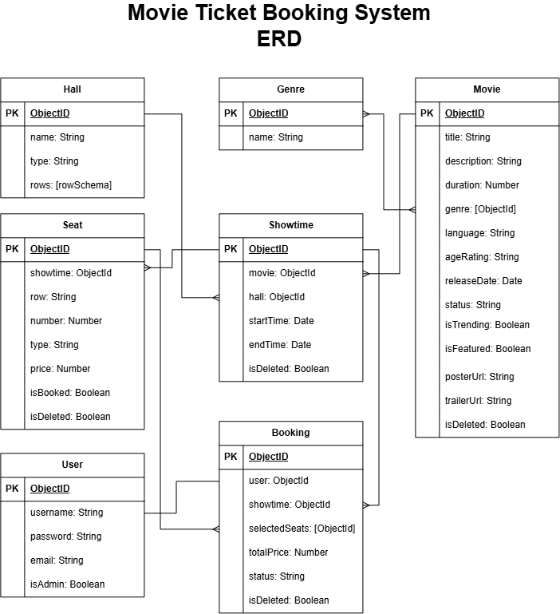

# Movie Ticket Booking System

## Overview
The **Movie Ticket Booking System (MTBS)** is a full-stack web application that allows users to browse movies, view available showtimes, select seats, and manage their bookings. 
The system also provides administrators with tools to manage movies, cinema halls, and showtimes. It includes secure authentication, role-based access, automatic seat generation, seat-availability validation, and booking-status management.

## Screenshots

## Technologies Used

### Front End
- HTML5
- CSS3
- JavaScript
- EJS

### Back End
- Node.js
- Express.js
- MongoDB
- Mongoose

### Development Tools
- Git
- GitHub
- Visual Studio Code
- Nodemon
- Morgan
- Method Override
- dotenv

## Getting Started

## Installation

## User Stories

### Guest
- As a guest, I want to browse movies so that I can see what is currently showing or coming soon.
- As a guest, I want to view movie details and showtimes so that I can decide what to watch.
- As a guest, I want to create an account so that I can book movie tickets.

### User
- As a user, I want to choose a showtime that suits my schedule.
- As a user, I want to view available seats so that I can choose where to sit.
- As a user, I want to see the ticket prices and total cost before booking.
- As a user, I want to book one or more available seats.
- As a user, I want to view my upcoming, previous, and canceled bookings.
- As a user, I want to cancel an upcoming booking when my plans change.

### Admin
- As an admin, I want to add, edit, and remove movies.
- As an admin, I want to create halls with different seating configurations.
- As an admin, I want to edit and remove cinema halls.
- As an admin, I want to view available halls and time slots before scheduling a movie.
- As an admin, I want to create showtimes without causing scheduling conflicts.

## Database Design

 

## Routes

### Home

| Method | Route | Description | Access |
|---|---|---|---|
| GET | `/` | Display the home page | Public |

### Authentication

| Method | Route | Description | Access |
|---|---|---|---|
| GET | `/auth/sign-up` | Display the sign-up form | Public |
| POST | `/auth/sign-up` | Create a new user account |  |
| GET | `/auth/sign-in` | Display the sign-in form | Public |
| POST | `/auth/sign-in` | Authenticate and sign in a user | Public |
| GET | `/auth/sign-out` | Sign out the current user | User |

### Movies

| Method | Route | Description | Access |
|---|---|---|---|
| GET | `/movies` | Display movies filtered by their status | Public |
| GET | `/movies/:movieId` | Display movie details and available showtimes | Public |
| GET | `/movies/new` | Display the add movie form | Admin |
| POST | `/movies` | Create a new movie | Admin |
| GET | `/movies/:movieId/edit` | Display the edit movie form | Admin |
| PUT | `/movies/:movieId` | Update a movie | Admin |
| DELETE | `/movies/:movieId` | Soft-delete a movie and its related data | Admin |

The movies page also supports filtering through a query parameter:

| Method | Route | Description |
|---|---|---|
| GET | `/movies?status=now-showing` | Display movies that are currently showing |
| GET | `/movies?status=coming-soon` | Display upcoming movies |

### Halls

| Method | Route | Description | Access |
|---|---|---|---|
| GET | `/halls` | Display all cinema halls | Admin |
| GET | `/halls/new` | Display the add hall form | Admin |
| POST | `/halls/new` | Validate the hall details and display the row configuration form | Admin |
| POST | `/halls` | Create a hall with its configured rows | Admin |
| GET | `/halls/:hallId/edit` | Display the edit hall form | Admin |
| PUT | `/halls/:hallId` | Update a hall’s row configuration | Admin |
| DELETE | `/halls/:hallId` | Delete a cinema hall | Admin |

### Showtimes

| Method | Route | Description | Access |
|---|---|---|---|
| GET | `/showtimes/:movieId` | Display the date-selection page | Admin |
| GET | `/showtimes/new/:movieId` | Display the date-selection page | Admin |
| POST | `/showtimes/:movieId` | Display the available halls and time slots for a selected date | Admin |
| POST | `/showtimes/new/:movieId` | Create a showtime and generate its seats | Admin |

### Bookings

| Method | Route | Description | Access |
|---|---|---|---|
| GET | `/bookings` | Display the signed-in user’s bookings | User |
| GET | `/bookings/new/:showtimeId` | Display the seat-selection page | User |
| POST | `/bookings/new/:showtimeId` | Validate the selected seats and create a booking | User |
| POST | `/bookings/cancel/:bookingId` | Cancel a booking and release its seats | User |

The bookings page supports filtering by status:

| Method | Route | Description |
|---|---|---|
| GET | `/bookings?status=Upcoming` | Display upcoming bookings |
| GET | `/bookings?status=Previous` | Display previous bookings |
| GET | `/bookings?status=Cancelled` | Display canceled bookings |

 

## Features

### Guest Features
- Browse currently showing and upcoming movies
- View movie details, including genres, cast, director, rating, and trailer
- View available showtimes by date and cinema hall type
- Create a new account
- Sign in to an existing account

### User Features
- Select available seats using an interactive seating plan
- View seat types and ticket prices
- See the booking total update based on the selected seats
- Complete a movie ticket booking
- View upcoming, previous, and canceled bookings
- Filter bookings by status
- Cancel an upcoming booking
- Automatically release seats when a booking is canceled

### Admin Features
- Add, edit, and remove movies
- Manage movie details, genres, status, and featured options
- Create cinema halls with different hall types
- Configure the number, size, and seat type of hall rows
- Edit and delete cinema halls
- Select a date and view available halls and time slots
- Create showtimes for specific movies
- Prevent conflicting showtimes in the same hall
- Automatically generate seats when a showtime is created

### System Features
- Secure password hashing with bcrypt
- Session-based authentication
- Role-based authorization for users and administrators
- Seat availability validation before confirming a booking
- Automatic booking price calculation
- Soft deletion of movies and their related data

 

## Future Enhancements
- Integrate secure online payment processing
- Allow users to add snacks and drinks to their bookings
- Send booking confirmations and digital tickets by email
- Generate QR codes for ticket verification
- Add movie search, sorting, and advanced filtering
- Allow users to rate and review movies
- Add password recovery and email verification
- Allow users to update their account information
- Add booking refunds and cancellation deadlines
- Send notifications for upcoming showtimes
- Improve mobile responsiveness and accessibility

## Credits
Developed by **Zahraa Alaiwi** as part of *the General Assembly Software Engineering Bootcamp*.